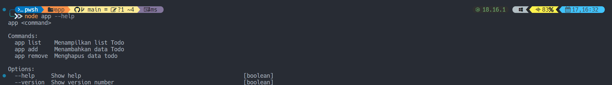
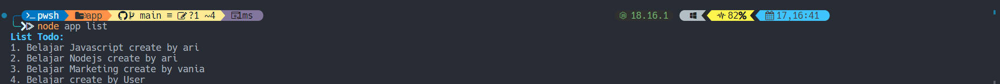
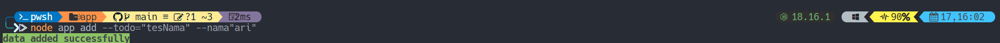
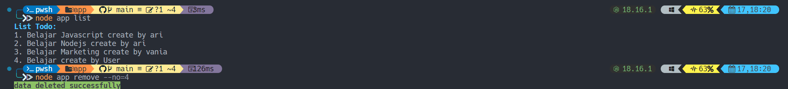

# TodoListApp-cli

### Sebuah aplikasi todolist sederhana yang berjalan menggunakan comand line interface (terminal) dibuat menggunakan teknologi Nodejs.

Untuk menjalankan aplikasi ini anda harus menginstall nodejs terlebih dahulu. jika sudah terinstall maka anda harus menginstal dependecies todolistApp ini.

> ketikan perintah berikut

```
npm install
```

setelah selesai mengistallnya maka anda harus masuk ke directory App

> ketikan perintah berikut

```
cd app
```

directory APP merupakan Root dari struktur folder yang ada di todolistApp ini. jika ingin mengetahui Command apa saja yang tersedia di todolistApp ini maka

> ketikan perintah berikut

```
node app --help
```



#

jika ingin menampilkan sebuah list Todo yang sudah dibuat maka lakukan berikut

> Ketikan perintah berikut

```
node app list
```



#

tidak hanya melihat todolist yang sudah dibuat, ketikan comand `add --todo=<value[string]` untuk menambahkan data yaitu beruba data todonya
dan nama yang membuatnya (opsional) `add --nama=<value[string]` dengan melakukan perintah berikut

> ketikan perintah berikut

```
node app add --todo=<value[string]> --nama=<value[string]>
```



#

dan untuk menghapus data yang sudah dibuat, lakukan perintah remove dan sesuaikan dengan nomer urutanya yang akan dihapus datanya.

```
node app remove --no=<value[number]>
```


